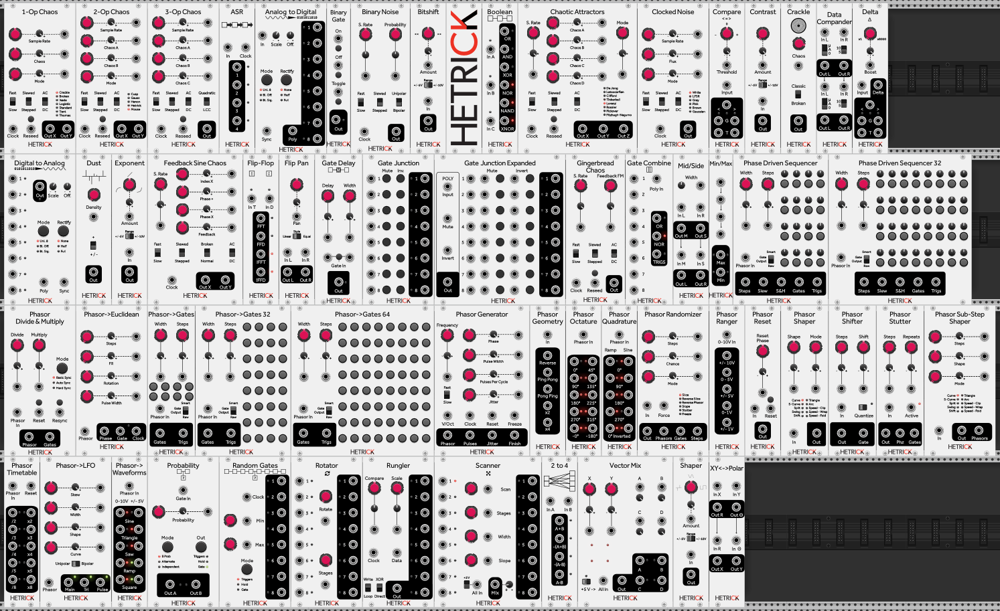

# HetrickCV for VCV Rack

HetrickCV is a collection of [VCV Rack](https://vcvrack.com/) modules by Michael Hetrick of [Unfiltered Audio](https://www.unfilteredaudio.com/). Many of these are ported from [Euro Reakt for Reaktor 6](https://www.native-instruments.com/en/reaktor-community/reaktor-user-library/entry/show/9093/).

### Releases

HetrickCV is compatible with VCV Rack 2.0.0 and later. Releases can be found on the [Release Page](https://github.com/mhetrick/hetrickcv/releases), including auto-generated "Nightly" releases from the latest commit. There is a "v1" branch for code compatible with VCV Rack versions prior to 2.0.0.

## Contributing

I welcome Issues and Pull Requests to this repository if you have suggestions for improvement.

# HetrickCV User Manual

## By Topic
- [Chaos and Noise](./docs/Topics/Chaos.md)
- [Phasors](./docs/Topics/Phasors.md)
- [Waveshaping](./docs/Topics/Waveshaping.md)

## By Module

- [1-Op Chaos](./docs/Topics/Chaos.md)
- [2-Op Chaos](./docs/Topics/Chaos.md)
- [3-Op Chaos](./docs/Topics/Chaos.md)
- [2-to-4 Mix Matrix](./docs/Modules/TwoToFour.md)
- [ASR](./docs/Modules/ASR.md)
- [Analog to Digital](./docs/Modules/AToD.md)
- [Binary Gate](./docs/Modules/BinaryGate.md)
- [Binary Noise](./docs/Modules/BinaryNoise.md)
- [Bitshift](./docs/Modules/Bitshift.md)
- [Blank Panel](./docs/Modules/BlankPanel.md)
- [Boolean Logic](./docs/Modules/BooleanLogic.md)
- [Chaotic Attractors](./docs/Topics/Chaos.md)
- [Clocked Noise](./docs/Modules/ClockedNoise.md)
- [Comparator](./docs/Modules/Comparator.md)
- [Contrast](./docs/Modules/Contrast.md)
- [Crackle](./docs/Topics/Chaos.md)
- [Data Compander](./docs/Modules/DataCompander.md)
- [Delta](./docs/Modules/Delta.md)
- [Digital To Analog](./docs/Modules/DToA.md)
- [Dust](./docs/Topics/Chaos.md)
- [Exponent](./docs/Modules/Exponent.md)
- [FeedbackSineChaos](./docs/Topics/Chaos.md)
- [Flip Flop](./docs/Modules/FlipFlop.md)
- [Flip Pan](./docs/Modules/FlipPan.md)
- [Gate Combiner](./docs/Modules/GateCombiner.md)
- [Gate Junction](./docs/Modules/GateJunction.md)
- [Gate Junction Expanded](./docs/Modules/GateJunction.md)
- [Gingerbread Chaos](./docs/Topics/Chaos.md)
- [Mid-Side Converter](./docs/Modules/MidSide.md)
- [Min-Max](./docs/Modules/MinMax.md)
- [Phase Driven Sequencer](./docs/Modules/PhaseDrivenSequencer.md)
- [Phasor Analyzer](./docs/Modules/PhasorAnalyzer.md)
- [Phasor Burst Generator](./docs/Modules/PhasorBurstGen.md)
- [Phasor Divide & Multiply](./docs/Modules/PhasorDivMult.md)
- [Phasor Generator](./docs/Modules/PhaseGen.md)
- [Phasor Geometry](./docs/Modules/PhasorGeometry.md)
- [Phasor Octature](./docs/Modules/PhasorQuadrature.md)
- [Phasor Quadrature](./docs/Modules/PhasorQuadrature.md)
- [Phasor Randomizer](./docs/Modules/PhasorRandom.md)
- [Phasor Ranger](./docs/Modules/PhasorRanger.md)
- [Phasor Reset](./docs/Modules/PhasorReset.md)
- [Phasor Rhythm Group](./docs/Modules/PhasorRhythmGroup.md)
- [Phasor Shaper](./docs/Modules/PhasorShape.md)
- [Phasor Shifter](./docs/Modules/PhasorShifter.md)
- [Phasor Stutter](./docs/Modules/PhasorStutter.md)
- [Phasor Substep Shaper](./docs/Modules/PhasorShape.md)
- [Phasor Timetable](./docs/Modules/PhasorTimetable.md)
- [Phasor to Clock](./docs/Modules/PhasorToClock.md)
- [Phasor to Euclidean](./docs/Modules/PhasorEuclidean.md)
- [Phasor to Gates](./docs/Modules/PhaseToGates.md)
- [Phasor to LFO](./docs/Modules/PhasorToLFO.md)
- [Phasor to Waveforms](./docs/Modules/PhasorToWaveforms.md)
- [Probability](./docs/Modules/Probability.md)
- [Random Gates](./docs/Modules/RandomGates.md)
- [Rotator](./docs/Modules/Rotator.md)
- [Rungler](./docs/Modules/Rungler.md)
- [Scanner](./docs/Modules/Scanner.md)
- [XY to Polar](./docs/Modules/XYToPolar.md)
- [Waveshaper](./docs/Modules/Waveshaper.md)

