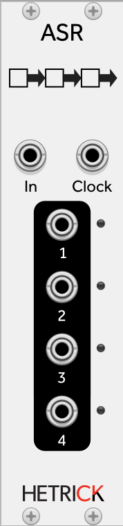

## ASR
This can be thought of as a quad Sample-and-Hold. It is useful for creating melodic rounds and canons. When it receives a positive Clock input, the current voltage at the main input will be sampled and sent to the first output. On the next positive Clock input, the current voltage of the first output will be moved to the second output, and the first output will sample the main input again.

Patch Ideas:
- Connect a sequencer to the main input. Connect the sequencer's clock to the Clock input. Connect the ASR's outputs to various oscillators that are tuned to the same base frequency. Mix the oscillator outputs together and listen to the complex voicings that are created.