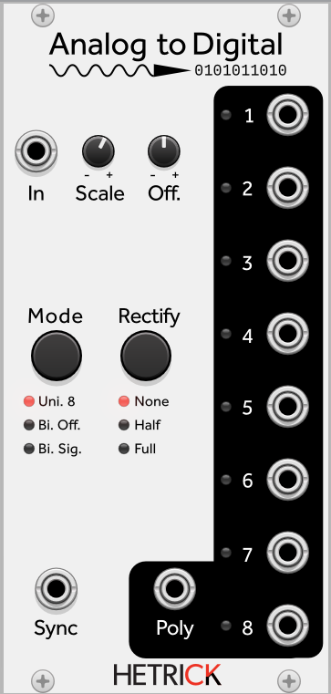

## Analog to Digital
This module takes a signal and turns it into an 8-bit representation. The eight outputs represent the state of the bits (+5V if the bit is 1, 0V if the bit is 0). If a signal is present on the Sync input, the bits will only be updated upon the reception of a positive gate. The signal runs through a rectification stage before being sent to the encoder. There are multiple rectification modes:
- Half: Negative signals are replaced with 0V.
- Full: Negative signals are inverted (the absolute value of the signal is used).
- None: The input signal is not affected.

There are also multiple encoding modes:
- Uni. 8: The input is half-wave rectified (in addition to whatever rectification mode was selected before the encoder stage). Bit 8 is the Most Significant Bit (meaning it will take a fairly loud input signal for the bit to go high). In this mode, the encoder will only respond to positive voltages.
- Bi. Off.: The input is converted from a bi-polar signal to a uni-polar signal through the use of an internal offset followed by scaling. The signal is then encoded in a manner similar to Uni. 8, where Bit 8 is the Most Significant Bit.
- Bi. Sig.: In this mode, Bit 7 becomes the Most Significant Bit, while Bit 8 encodes whether or not the signal at the input is negative.

Patch ideas:
- Use a slow LFO as the input. The various outputs become semi-related gate streams. Use primitive waveforms (sine, triangle, etc.) for more predictable results. Use the Audible Instruments Wavetable Oscillator in LFO mode and morph the waveform for unpredictable patterns.
- Use this in tandem with the Digital to Analog module to create custom waveshaping effects. You can wire the bits up "correctly" and simply change the various encoder, rectification, offset, and scaling parameters on both modules to come up with unusual permutations. You can wire the bits up more randomly to produce harsher effects. For a lot of fun, try placing the Rotator and/or the Gate Junction modules between the A-to-D and D-to-A converters.