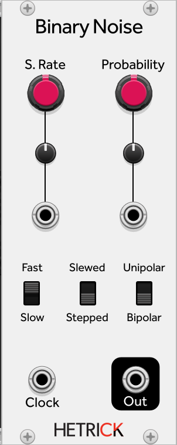

## Binary Noise
This noise generator will randomly generate a value of +/- 5V (or +5V and 0V in unipolar mode). At audio rates, this generates very loud, digital noise, while at lower rates this can be used to generate unpredictable gates. With slew mode enabled, it will interpolate cleanly between the two states, making it useful as a modulation source as well.

Patch ideas:
- Plug a different gate source into the Clock input. Use the probability control to shape how many gates reach the output.
- Run at audio rate and bipolar mode for really harsh square wave noise.