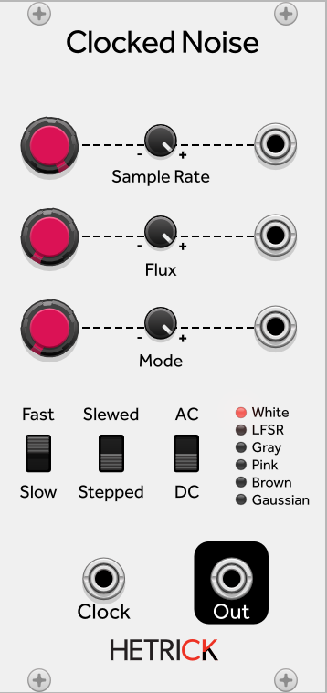

## Clocked Noise
This is similar to the [Multi-Op Chaos modules](./OpChaos.md), but it uses traditional noise modes. The Flux knob sets a random modulation amount to the Sample Rate parameter whenever a new sample is generated.