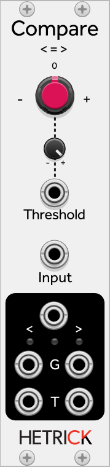

### Comparator
This is a tool for comparing one signal against a specific voltage. It can be used for many purposes, including clock extraction or distortion. The Threshold knob sets the voltage that is used for comparison against the main Input. If the Input is greater than the Threshold voltage, the `>` outputs will fire. If the Input is less than the Threshold voltage, then the `<` outputs will fire.

The G outputs are gates and will stay high for as long as the voltage comparison is true. The T outputs are triggers and will stay high for 1 ms. The output between the comparison symbols is a Crossing Trigger, and will fire whenever the signal crosses the threshold. It is essentially the sum of the other two trigger outputs.

Patch Ideas:
- Do you have an LFO that lacks a dedicated square output? Set the Threshold to 0.0 (12 o'clock) and use the LFO as the main Input (not as a modulator for the Threshold value). The `>` Gate will provide a square wave that is synced with the LFO.
- You can use this to turn an audio signal into a 1-bit representation. For extra fun, modulate the Threshold with another audio signal for a lot of destruction.
