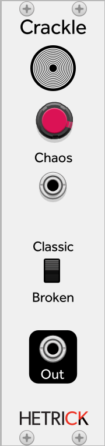

## Crackle
This is a chaotic system that generates a vinyl-like hiss with occasional pops. This is a direct port of [a UGen from SuperCollider](https://github.com/supercollider/supercollider/blob/master/server/plugins/NoiseUGens.cpp#L452). When I originally ported this to Euro Reakt, I accidentally implemented the internal copy operations in the wrong order, leading to the fun "Broken" mode. The Broken mode produces stutters, grains, and modem noises at high Chaos values.

Patch Ideas:
- Surprising things can happen if you modulate this with an audio signal... 