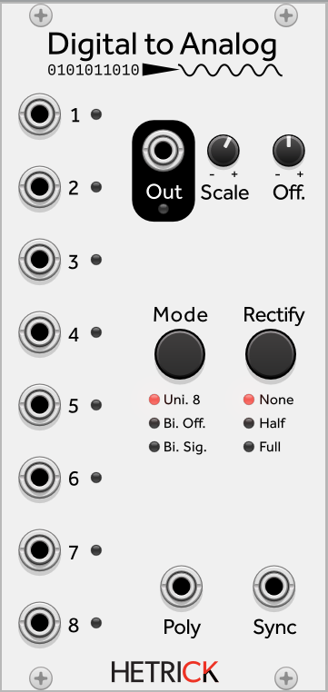

### Digital to Analog
This module is the inverse of the Analog to Digital encoder. It takes in eight inputs and produces a single voltage based off of the state of the inputs and the selected decoder mode. The decoder modes are the inverse of the encoder modes described above in the Analog to Digital documentation. If you directly connect the two modules and use the same encoding/decoding modes, the output is typically identical to the input aside from accuracy degradation from the 8-bit representation.

Patch Ideas:
- See the Analog to Digital documentation above for creative ways of mangling the bits between the modules.
- Connect various, rhythmic gate streams to the inputs. The output is a stepped voltage based on the state of the inputs. This will be a jumpy voltage that is related to various rhythms happening inside of the patch.