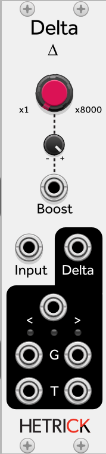

### Delta
This is a tool that extracts a signal's rate of change. It compares a signal's current value against its previous value. The amount of change is multiplied by the Delta Boost parameter and sent to the Delta output. Slow moving signals will have very small rates of change and will need a lot of Boost. Fast, audio-rate signals will need very little boost.

The `>` outputs will go high whenever the signal experiences a positive rate of change. The `<` outputs will go high whenever the signal experiences a negative rate of change. The G outputs are gates that stay high for as long as the signal is moving in that direction. The T outputs are triggers that last for 1 ms. The jack in between the comparison symbols is a trigger output that fires whenever the signal changes direction.

Patch Ideas:
- You can use this to extract a clock trigger from an LFO. It will generate a trigger whenever the LFO changes direction. A sine wave will produce stable, steady triggers. Use a wavetable LFO (like the alternate Sheep mode on Tides) to generate more complex rhythms.

