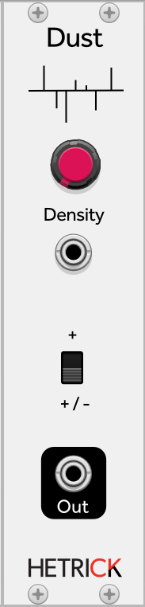

### Dust
Like [Crackle](./Crackle.md), this is a direct port of [a SuperCollider Noise UGen](https://github.com/supercollider/supercollider/blob/master/server/plugins/NoiseUGens.cpp#L376). This module will produce randomly spaced impulses with random amplitudes. At low frequencies, this is useful as a random trigger generator. At high frequencies, this is a white noise source.

Patch Ideas:
- Connect the output of Dust to the input of a highly resonant filter. Use a slower frequency on Dust to ping the filter and create sine grains.
- Using the patch above, also link Dust's output to a sequencer's input. Use the sequencer to change the filter's cutoff frequency.