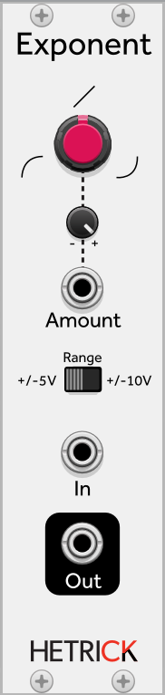

### Exponent
This is a simple waveshaper that will raise the input voltage to a power specified by the Amount knob. Turning the knob clockwise will make the output signal more exponential, while turning the knob counter-clockwise will make the output signal more logarithmic. This will have a mild effect on audio signals, but it is extremely useful for shaping LFOs and envelopes.