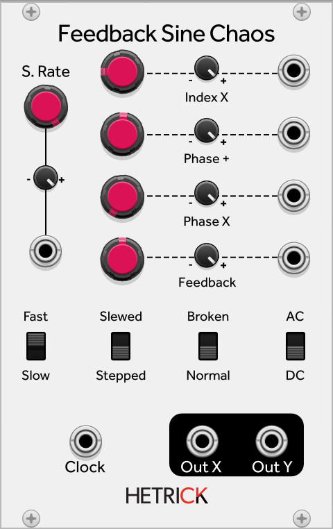

## Feedback Sine Chaos
This is an algorithm ported over from Supercollider. This shares a similar set of controls with the Chaos modules described above. However, instead of a traditional chaos map, it uses a sine wave oscillator. The chaotic behavior occurs when manipulating the underlying phasor in unusual ways, including self feedback.