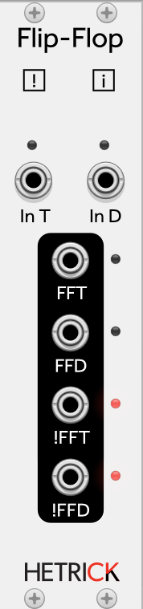

### Flip Flop
"Flip Flop" is an engineering/electronics term to describe what is typically a toggle switch with potential conditional behavior. There are two types of Flip Flops on this module: a Flip Flop T (toggle) and Flip Flop D (data).
The Flip Flop T can be thought of as a gate controlled light switch (or, in more modular thinking, a /2 clock divider). A positive gate on the IN T input will turn the FFT output on, and the next gate will turn it off.
The Flip Flop D can be thought of as a sample-and-hold for gates only. A positive gate on the IN T input will sample the input at IN D. If IN D is above 1V, the FFD output will turn on. If IN D is below 1V, the FFD output will turn off.
For convenience, there are additional outputs that provide the opposite state of the FFT and FFD outputs.