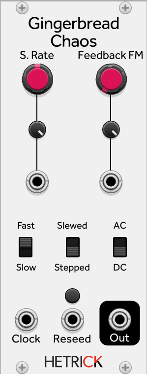

### Gingerbread Chaos
This is a simpler chaos module than the [Multi-Op Chaos modules](./OpChaos.md). Instead of having a dedicated Chaos control, the sound/shape of the map is determined by its initial conditions. The initial conditions can be rerolled using the Reseed gate input or button.