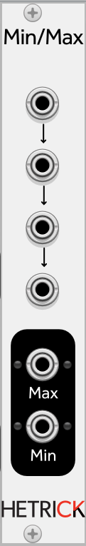

### Min-Max
This module accepts up to four inputs. The Max output is the largest voltage found on the four inputs, while the Min output is the lowest voltage. The inputs feed each other from top-to-bottom as an easy way to avoid one of the jacks from being set to a constant 0V. However, if you want a constant 0V on one of the jacks (for instance, if you would like to use the Max output as a half-wave rectifier), simply patch the inputs from the bottom up and leave at least the top jack unplugged.