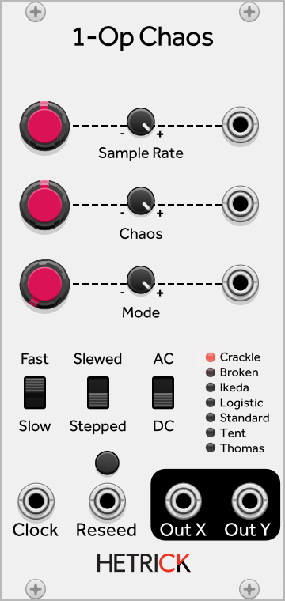
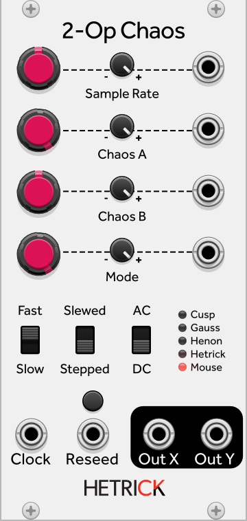
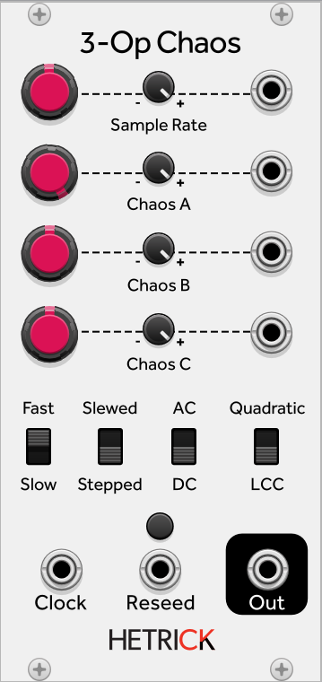
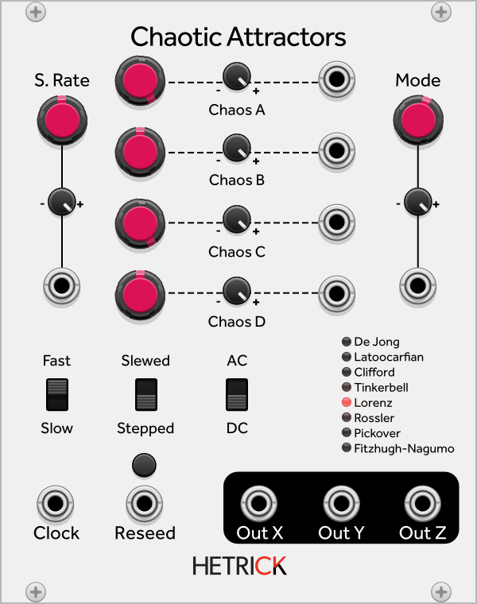

## 1/2/3-Op Chaos and Chaotic Attractors

These four modules cover a wide variety of chaotic equations, many of which have multidimensional outputs. These can run at audio or modulation rates, or they can be manually clocked. Additionally, the Slewed mode linearly interpolates between values. This mode is perfect for smooth modulation, but it is also useful as a low-pass filter when running at audio rates. The intensity of the slew is connected to the Sample Rate control, so if you are manually clocking this module make sure that you tweak the Sample Rate if you are in Slewed mode.
The Sample Rate control is present instead of a Frequency control, since these chaotic maps are typically not periodic (Yes, some of the maps, like the 1-Op Logistic map, oscillate at low Chaos values, but these are exceptions more than the norm). As such, it's important to note that changing the sampling rate of your patch will greatly affect these modules.
The 3-Op Chaos module has only one output, while the rest of the modules are multi-dimensional. On the 1-Op and 2-Op Chaos modules, some of the maps (like Logistic) are one-dimensional. For these maps, the Y output is simply -X. On Chaotic Attractors, there are X, Y, and Z outputs. For the two-dimensional maps on this module, the Z output is X*Y.
Additionally, two of the maps have been modified from their original descriptions. On the Latoocarfian map, I replaced a Sine call with a Cosine call to help it stay away from values that kill it (i.e. set all the outputs to zero and prevent new values from being generated). On the Tinkerbell map, if all values reach 0.0, all values will be updated with a random value. This can produce fun, periodic noise bursts.
Speaking of which, if any of these maps seem to get stuck, be sure to try the Reseed button/input. This will "restart" the map by inserting new, random values into it.

