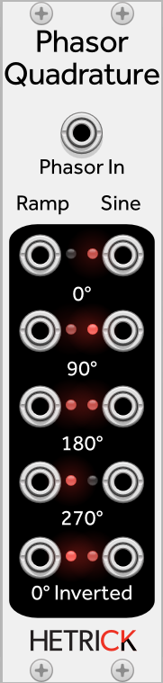
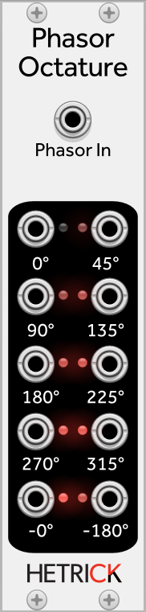

# Phasor Quadrature and Octature

These two modules provide many phase-shifted outputs generated from an incoming phasor. This is useful for creating multiple time-shifted sequences or modulations from a phasor.

Phasor Quadrature outputs both phasors and sinusoidal waves. Each output is phase shifted by 90 degrees.

Phasor Octature only outputs phasors. Each output is phase shifted by 45 degrees.