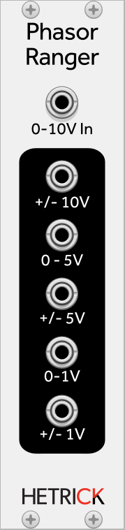

# Phasor Ranger

This simple utility takes a unipolar phasor and provides output variations that may be useful for various other modules. It provides three bipolar outputs in different voltage ranges, and two unipolar outputs.