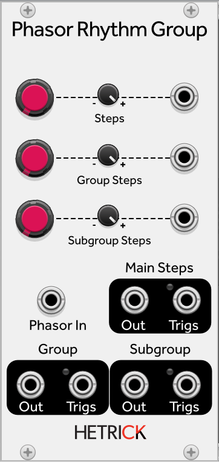

# Phasor Rhythm Group

Refer to [Tutorial 6 - Navigating Rhythmic Space](../Topics/PhasorTutorials/6-NavigatingRhythmicSpace.md) for details on how this algorithm works.

This module takes a phasor and breaks it into three related rhythmic groups. Each rhythmic group has outputs for group phasors and group triggers.