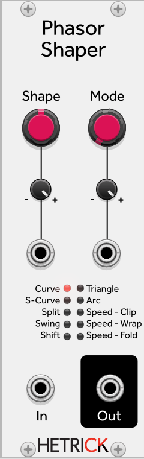
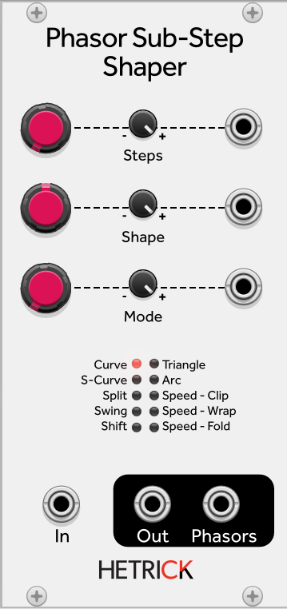

# Phasor Shaper

### Phasor Shaper

Processes phasor signals in interesting ways for sequence modification or phase distortion synthesis. The Shape and Mode parameters select the shaping algorithm.

### Phasor Substep Shaper

Processes individual steps of a phasor using the same shaping algorithms. Useful for step-based sequence warping or unusual phase distortion. Outputs both the shaped phasor and the shaped step envelope.
