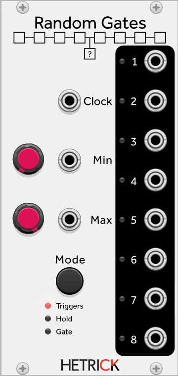

### Random Gates
This is a very useful module that routes an incoming gate to one of up to eight outputs. The output is randomly selected every time the input goes above 1V. The MIN control determines the minimum position of the output gate, while the MAX control determines the maximum position. For instance, with MAX fully clockwise, you can turn up the MIN control to ensure that only outputs 4 through 8 are selected.

There are three modes:
- Triggers: Whenever a positive gate is detected, the randomly selected output will fire a 1ms trigger.
- Hold: Whenever a positive gate is detected, the randomly selected output will stay positive until a new input gate is received.
- Gate: Whenever a positive gate is detected, the randomly selected output will stay positive until the input drops below 1V.