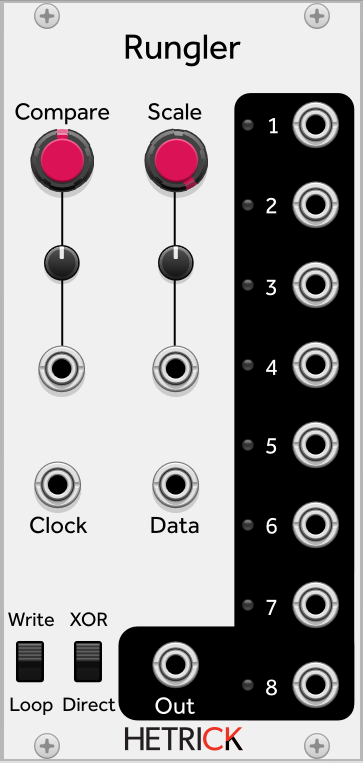

## Rungler

The Rungler is related to the [Analog Shift Register](./ASR.md). It is based on a modified ASR circuit by the late, great [Rob Hordijk](https://sdiy.info/wiki/Rob_Hordijk_Design). It is used in a number of his classic designs, including the Blippoo Box and the Benjolin.

The Rungler is an eight-bit shift register, with a stepped, analog output signal generated by the state of the last three bits in the register. A Clock input advances the register. A Data input assigns the On/Off value to the first bit (On when the Data input is above the value set by the Compare knob). The stepped output's amplitude is modified by the Scale knob. 

The XOR/Direct toggle on the bottom changes a key behavior of the Rungler. In Direct mode, the module emulates the behavior of earlier Runglers where the Data input directly sets the value of the first bit. XOR mode emulates the Rungler behavior present in the Benjolin and other designs. In XOR mode, the state of the first bit is determined by the logical XOR of the Data input and the state of the last bit. This is a lot less predictable!

The Write/Loop toggle determines a different feedback parameter. In Write mode, the module acts as described. In Loop mode, the Data input is ignored and the first bit is set only by the state of the last bit.