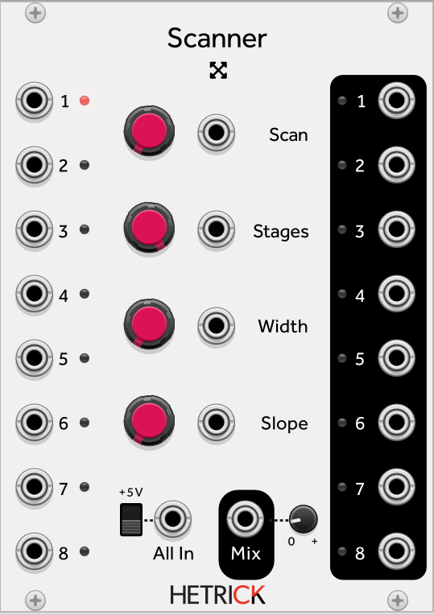

### Scanner
This module was inspired by the [Toppobrillo Mixiplexer](http://sdiy.org/toppobrillo/mixiplexer.html) and [Make Noise RxMx](http://www.makenoisemusic.com/modules/rxmx-legacy). It can be thought of as a smooth, CV-controlled 8-way switch.
The SCAN control determines which input is active. The STAGES control determines how many inputs the SCAN control can reach. The WIDTH control determines how many stages can be active at a time, while the SLOPE control determines how much smoothing occurs between scanned stages. Although it may sound complicated and esoteric, try out the following:

- 8-channel crossfader/mixer: Use up to eight different inputs. Monitor the Mix Out. Use the SCAN control to smoothly crossfade between the eight inputs.
- 8-channel distributor: Plug a modulation signal into the All In input. Manipulate the SCAN control to send that signal to up to eight destinations.
- 8 VCAs: Use up to eight different inputs. Manipulate the SCAN control and monitor the individual outputs.