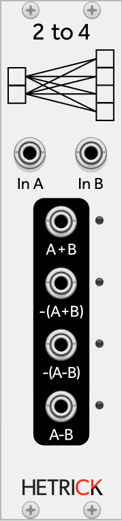

### 2-to-4 Mix Matrix
This simple module takes in two inputs (CV or Audio). It produces four outputs that are various combinations of the two inputs. It is based on [Julius O. Smith's description of a mix matrix for Schroeder Reverberators](https://ccrma.stanford.edu/~jos/pasp/Schroeder_Reverberators.html). Despite its original use for spatializing audio, this can be a great module for creating CV permutations.