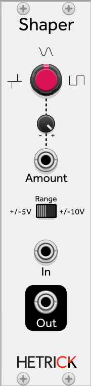

### Waveshaper
This is a hyperbolic waveshaper, the exact same one used on [Unfiltered Audio's Dent](https://unfilteredaudio.com/products/dent) (the SHAPE control in the top-row distortion). At 12 o'clock, the input signal is unaffected. As you turn the control clockwise, the signal is turned into a square wave. As you turn the contol counter-clockwise, signals are turned into needles. This is easiest to hear by using a sine wave input (you can see it by using the Fundamental Scope module).

Creatively, you could imagine that the shaper acts like a magnet. When turning the control clockwise, you could imagine that magnets are placed on the top and bottom of the waveform. Increasing the control intensifies the magnets, pulling the signal toward the boundaries and creating a square wave. When turning the control counter-clockwise, the magnet is instead placed at 0V. It pulls all but the strongest signals down to silence.

Patch Ideas:
- Use an oscillator or LFO with multiple shape outputs. Route a non-square output into the waveshaper's input. Use any other waveform to modulate the shape amount. This will "unlock" new waveforms for your oscillator. Alternatively, use a different oscillator at a different frequency to modulate the shape amount. This will create a lot of movement.