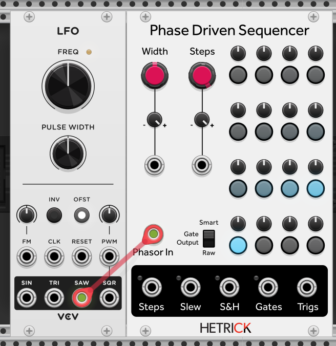
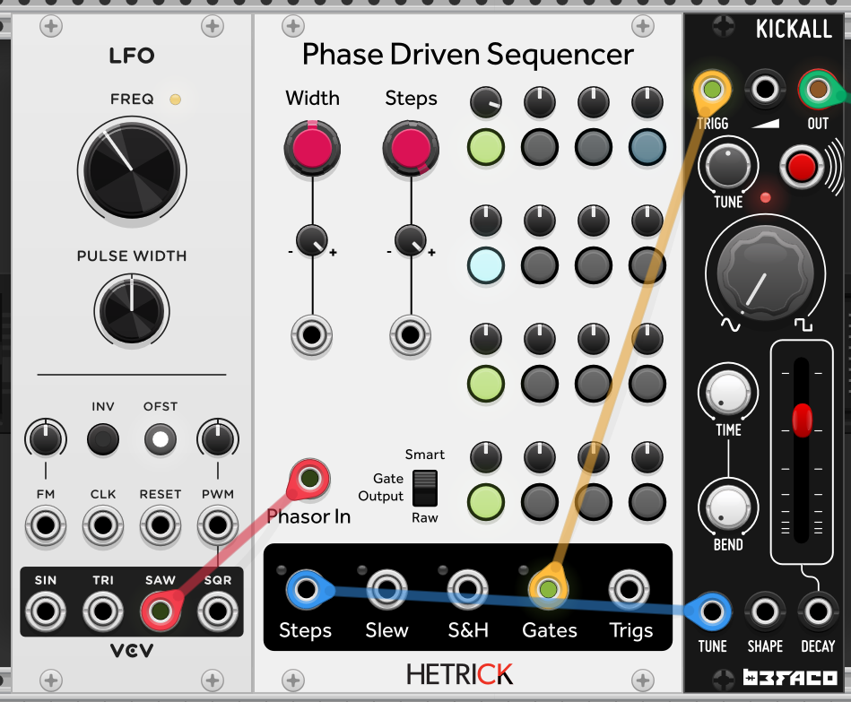
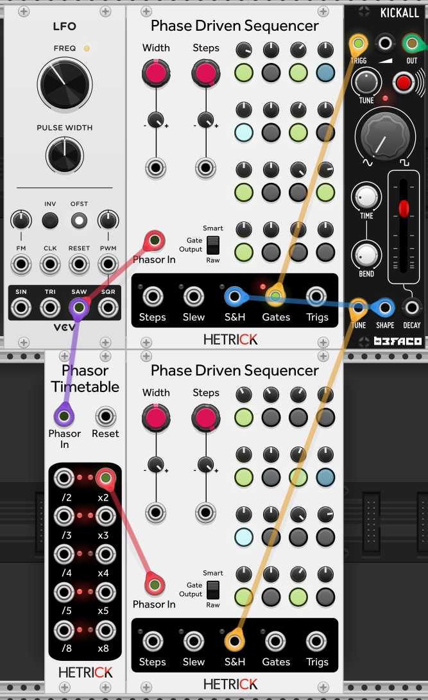

# Phase-Based Sequencing Tutorial 1 - First Steps

We will start by introducing the [Phase Driven Sequencer](../../Modules/PhaseDrivenSequencer.md). This 16-step sequencer outputs voltages and gates for its stages. To get started, simply connect the SAW output from the VCV Fundamental LFO to the Phasor In input on the Phase Driven Sequencer.

You should see a blue light travel from step 1 to step 16 repeatedly. You can adjust the frequency of the LFO to change the speed of this sequence. It may seem faster than the way that you are familiar with, as the one cycle of the LFO is the *speed of the entire sequence* instead of just the speed of a single step.

## Kick It

Let's add a drum voice. The Befaco Kickall is a kick generator available for free on the VCV Library.

To trigger the drum, I have connected the Gates output from the Phase Driven Sequencer to the TRIGG input on the Kickall. I have additionall connected the Steps output to the Tune input of the Kickall. Raise the Decay time of the Kickall and experiment with the three voltage outputs (Steps, Slew, and S&H).

- Steps: Voltages jump instantly between steps.
- Slew: Each step smoothly crossfades to the next. The speed of this crossfade is determined by the phasor and can be shaped through the use of phasor effects!
- S&H: This voltage output only updates when a gate is active, perfect for "parameter locking" of drums. 

## Multiple Sequence Speeds

Let's introduce one of the more useful effects in this collection: [Phasor Timetable](../../Modules/PhasorTimetable.md). This receives a phasor and outputs phasors that are time multiples or divisions of the incoming phasor--*even if the phasor is being warped in unusual ways!* Think of it like a Clock Divider but with way more flexibility.

In the image above, I have connected our original VCV LFO to the Timetable, and I've used it to sequence an additional Phase Driven Sequencer at twice the speed. We now have a simple way to run multiple sequencers at different speed while maintaining an exact phase relationship!

Next tutorial: [2 - Warp Speed](./2-WarpSpeed.md).