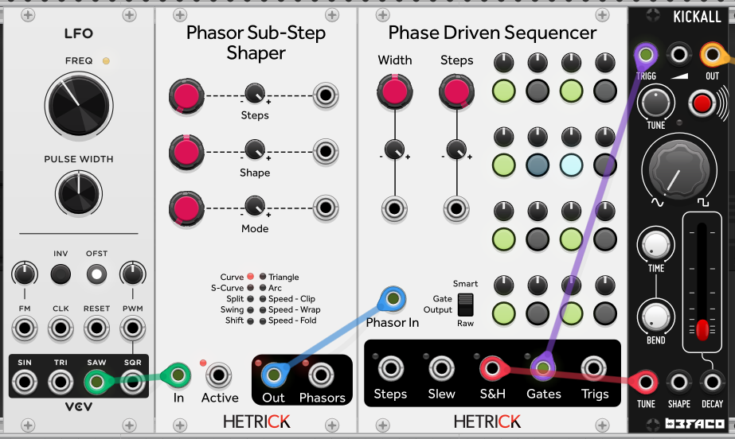
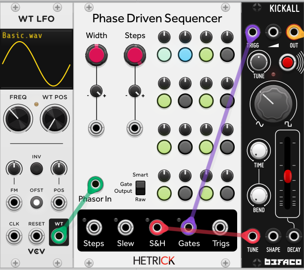
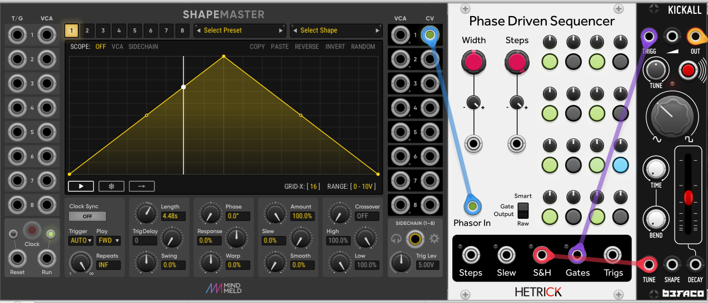

# Phase-Based Sequencing Tutorial 2 - Warp Speed

Let's start with the same initial patch as the [previous tutorial](./1-FirstSteps.md). We will drive the Phase Driven Sequencer with the VCV Fundamental LFO, and use the resulting sequence to trigger the Befaco Kickall.

## Bouncing ball

Introducing my favorite module: the [Phasor Sub-Step Shaper](../../Modules/PhasorShape.md). This module applies useful transforms to an incoming phasor. To start: use the default patch. Keep Steps to 1, Shape in the middle, and the Mode to Curve. Punch in a slightly denser, but evenly spaced gate sequence so that you can hear these next steps better.

Now that you have it setup, start modifying the Shape control. If you rotate the Shape control clockwise, you will hear your sequence start out slowly and then speed up (like a bouncing ball). Conversely, if you turn it counter-clockwise, the sequence will start quickly before slowing down.

Now, change the number of steps on the Sub-Step Shaper to 2. You will hear the effect happen twice over the course of your sequence! 

Let's try to make it swing. Set the number of steps on the Sub-Step Shaper to 4 and change the mode to Swing. Turn the Shape knob clockwise to 2 or 3 o'clock. You should now hear a traditional swing sound. Changing the number of steps in the Sub-Step Shaper will affect how the swing feeling is applied.

Experiment with the modes and the number of steps. You should quickly hear that this is wildly powerful. For extra fun, try the Phasor Timetable patch from the previous tutorial. Experiment with placing the Sub-Step Shaper before or after the Timetable to get different effects.

## Cut out the middleman

We can simplify this patch by using a weirder "phasor" generator. Replace the VCV LFO with the VCV WT LFO. This LFO uses a morphing shape instead of a dedicated SAW output. By default, the shape will by a sine.

Now that you are using a sine instead of an ascending ramp, your sequence will be going back-and-forth with a slight slow-down at the start and end. Morphing to a triangle (at Shape 33.333%) removes this slow-down. Finally, at Shape 66.666%, you have an ascending saw. If you go full square at 100% Shape, nothing particuarly useful happens as the sequence will flip-flop between the first step and last step. If you have a large collection of wavetables, well... time to experiment!

If you have been using VCV for a while, you are likely familiar with the masterpiece that is the [Mind Meld Shapemaster](https://library.vcvrack.com/MindMeldModular/ShapeMaster). Try replacing the WT LFO with a Shapemaster and connect it like the following image:

You can now draw *any* sequence shape that you can imagine. If you want to start with a regular ramp, go to Shapes->MindMeldShapes->BasicShapes->Ramp. It is important to note, though, that Shapemaster doesn't instantly jump from the last step to the first step, so you may hear ghost triggers or slews. For very accurate phasor behavior, I recommend using the HetrickCV [Phasor Generator](../../Modules/PhaseGen.md) or sticking with the simpler VCV LFO.

Next Tutorial: [3 - Ratcheting Up](./3-RatchetingUp.md)