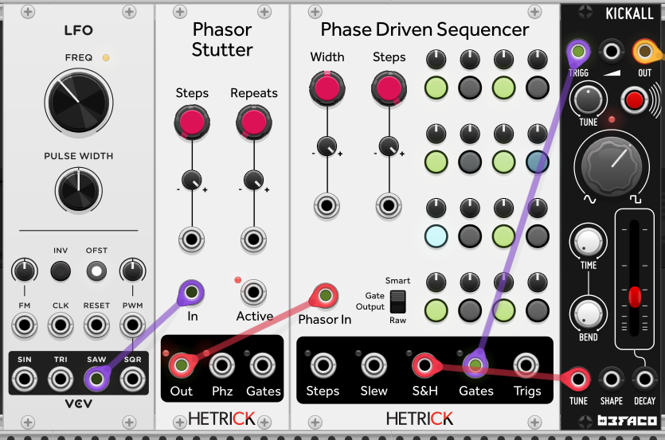
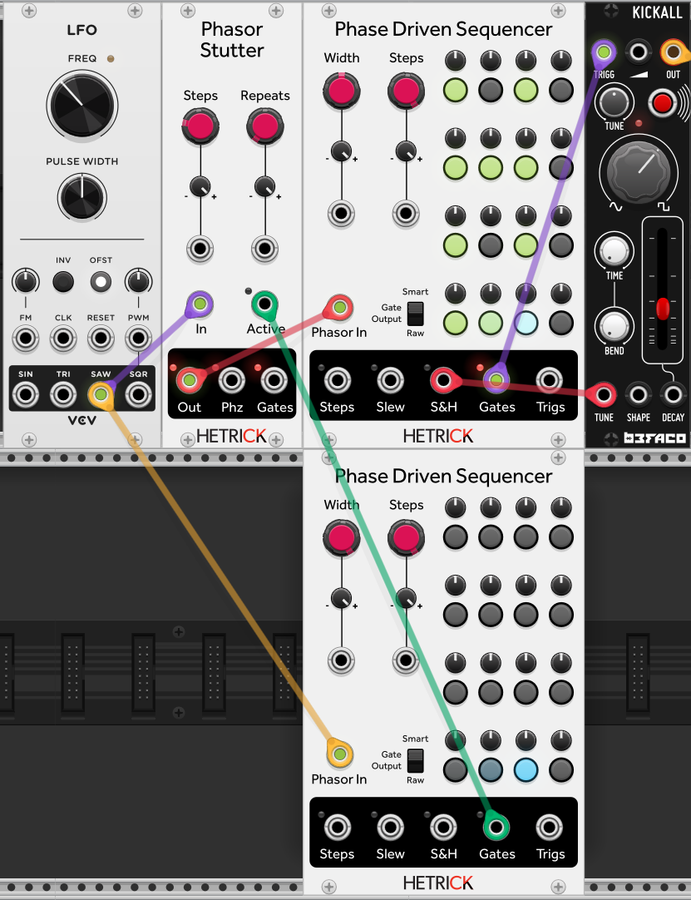
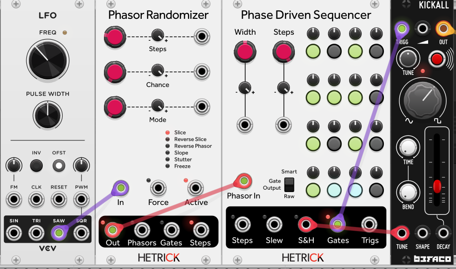

# Phase-Based Sequencing Tutorial 3 - Ratcheting Up

Phasors give us all of this position data. Let's use it to target individual steps!

We will start with a basic patch using the [Phasor Stutter](../../Modules/PhasorStutter.md) module. We will setup the basic Kickall patch from the [first tutorial](./1-FirstSteps.md) again, but this time we will add the Phasor Stutter module between the LFO and the Sequencer.

The Phasor Stutter module takes a phasor and rapidly repeats either the entire phasor or portions of it.

Start with Stutter Steps 1 and change the number of Repeats to 2. You will hear and see that the sequence is playing twice as fast.

Now, change the number of Stutter Steps to 4 and Repeats to 2. You will now see that we have divided our 16-step sequencer by 4 and are playing each 4-step section twice before moving onto the next. Wow!

Finally, change the number of Stutter Steps to 16. You will now hear every individual step play twice. This might be happening very rapidly, so slow down the LFO if you can't hear the effect properly.

This doubling of every step is powerful, but it might not sound all that useful for your music. What if we only want to double one or two of the steps? Thankfully, this isn't too difficult. We simply need to add another Phase Driven Sequencer.

## Don't Make Me a Target

Add this second Sequencer, and change its Gate Width to 100%. Use the regular LFO phasor to drive this sequencer, not the stuttered phasor. Plug the Gates output to the Stutter Active input. You should hear the Stutter effect stop, and the Active light will turn off. It is now waiting for a gate.

To turn on stuttering for a single step, simply turn on one of the gates on the second sequencer. That step will now stutter! For even more flexibility, plug the Steps output of the second Phase Driven Sequencer into the Repeats CV input of Phasor Stutter. Not only do you now have per-step control of stuttering, you can now modify how many stutters occur on each step!

## I'm So Random

Your mind might be spinning with tons of possibilities right now. Before you run of, let's give you another powerful effect: [Phasor Randomizer](../../Modules/PhasorRandom.md)

Your previous favorite sequencer might have various playback directions: Forward, Backwards, Random, etc. Wouldn't it be fun if you could have one direction most of the time, but random steps every so often?

Place the Randomizer between the LFO and the Sequencer, and set the number of Randomizer Steps to 16. Keep Slice mode on, and start increasing the Chance parameter on the Randomizer. You should now see that the Sequencer is going to randomly selected steps without losing its input phase. At 100% Chance, the every step will be randomized, but you can still turn down the Chance parameter to get back to the original input phasor.

Furthermore, just like the Stutter module above, the Randomizer has an Active gate input along with a Force Randomization gate input, so you can choose exactly which steps you want randomized instead of leaving everything up to chance.

Next Tutorial: [4 - Polymeters and Polyrhythms](./4-PolymeterPolyrhythm.md)