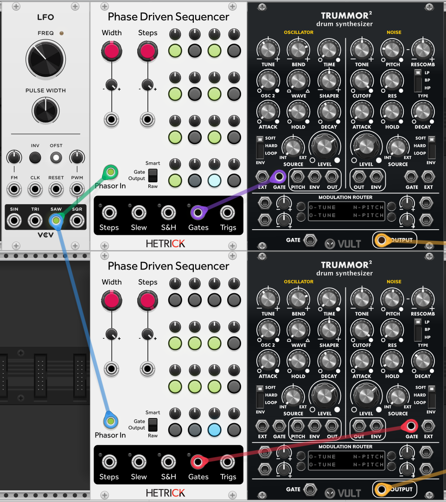
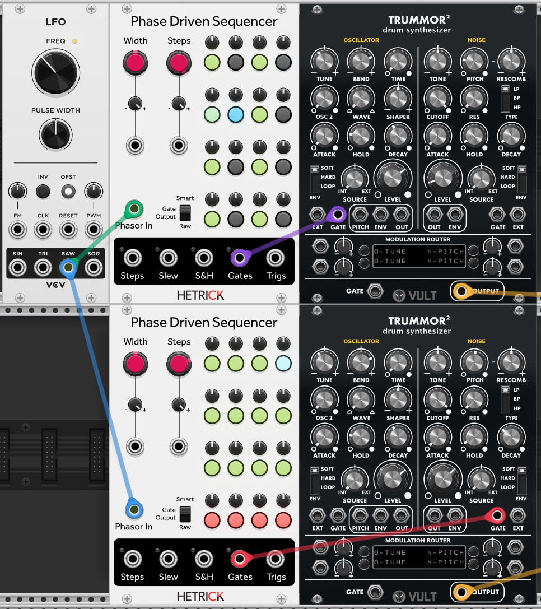
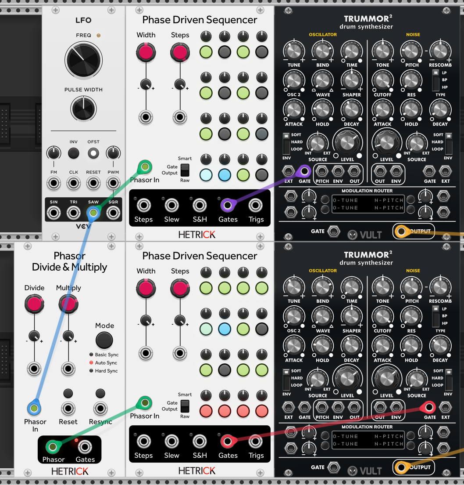
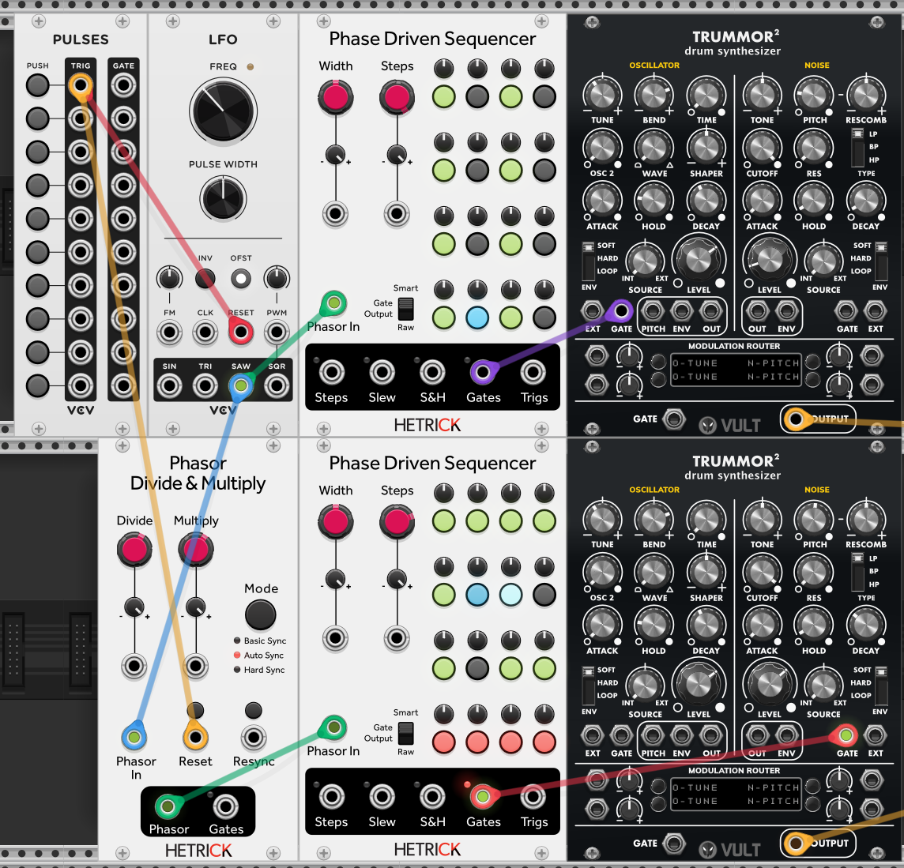
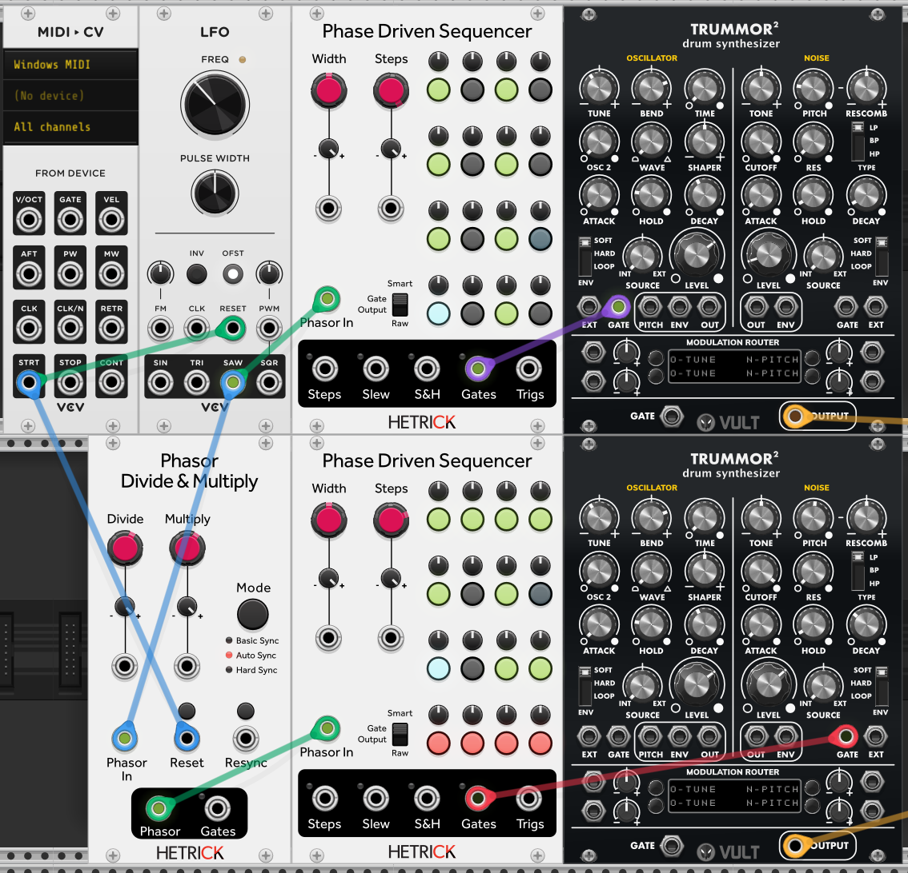

# Phase-Based Sequencing Tutorial 4 - Polymeter and Polyrhythms

If you've been using sequencers for a while, you might be wondering how to deal with the common techniques of polymeter and polyrhythm.

## Poly What?
These two terms are often confused. There are lots of YouTube videos diving into these, but I'll quickly define them here.

Polymeter happens when you have two sequencers with different sequence lengths, but they are running at the same clock speed.  For instance, you might have a 5-step sequence running against a 4-step sequence. These two sequencers are driven by the same clock and will match up every 20 steps.

Polyrhythm is when you have two sequences with different time bases. The most common polyrhythms are when you blend triplets with non-triplet rhythms, like 3 triplets against 2 eighth notes.

## Another Drummer

We want different tones so that we can differentiate our sequences. If you happen to own VCV Drums, you could use those here. A great free option is [Vult Trummor 2](https://library.vcvrack.com/VultModulesFree/Trummor2). Without diving too much into programming these modules, you'll want to setup two tones like a kick and a hi-hat and connect them to two Phase Driven Sequencer driven by the same phasor. Here's an example patch:

The top Trummor is my kick (it is the default Trummor patch). On the bottom Trummor, I have made a hi-hat by only triggering the NOISE side and increasing the LEVEL and DECAY parameters.

To create your first phasor polyrhythm, set the second sequencer to 12 steps and turn on all steps.

If you set it up like the patch above, you should now hear triplet hi-hats against eighth-note kicks.

## Polymeter and Multiple Phasors

Polymeter is slightly more complicated to setup, but very flexible once you have it running. The best tool for the job is [Phasor Divide & Multiply](../../Modules/PhasorDivMult.md). This takes in a phasor and outputs another phasor at a different speed, along with multiple ways of keeping it synced up in phase.

To get running, drive the Phasor Divide & Multiply with the VCV LFO, and use the Phasor Divide & Multiply to drive the second drum.

Now, set the Phasor Divide & Multiply to Auto Sync. To get a 16-beat sequencer to run in polymeter against a 12-beat sequencer, we need some light math. Right-click the Divide knob and type in the value 12 (the number of beats on our secondary sequence). Right-click the Multiply knob and type in the value 16 (the number of beats on our primary sequence). If the fact that this is not a simplified fraction upsets you, you can change this to Divide 3 and Multiply 4.

The phase of the secondary phasor might have wandered a bit while you were changing the Divide/Multiply values. If that's the case, just hit the Resync button to gain a new phase lock.

## Wait, Get Back in Line!

If you are going to experiment a lot, it might be worth adding a primary Reset button to your patch. I typically use VCV Pulses for this. Here's an example on how to wire it up. Just click the PUSH button to reset all of your phasors.

If you are using VCV inside of a DAW, you can use a VCV MIDI->CV module to sync your phasors to playback. Simply connect the STRT output to reset your phasors whenever the DAW transport begins playback.

I hope that this tutorial provided a helpful start to your phase sequencing adventure. Get out there and experiment!