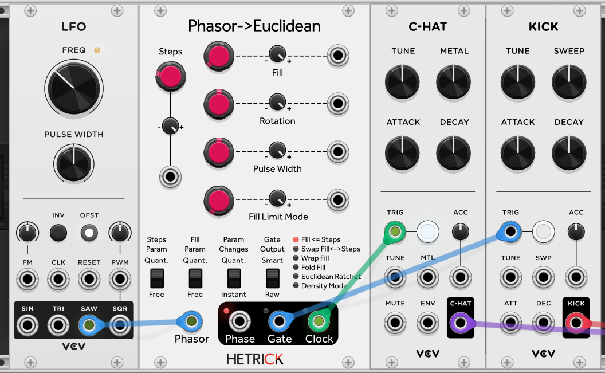
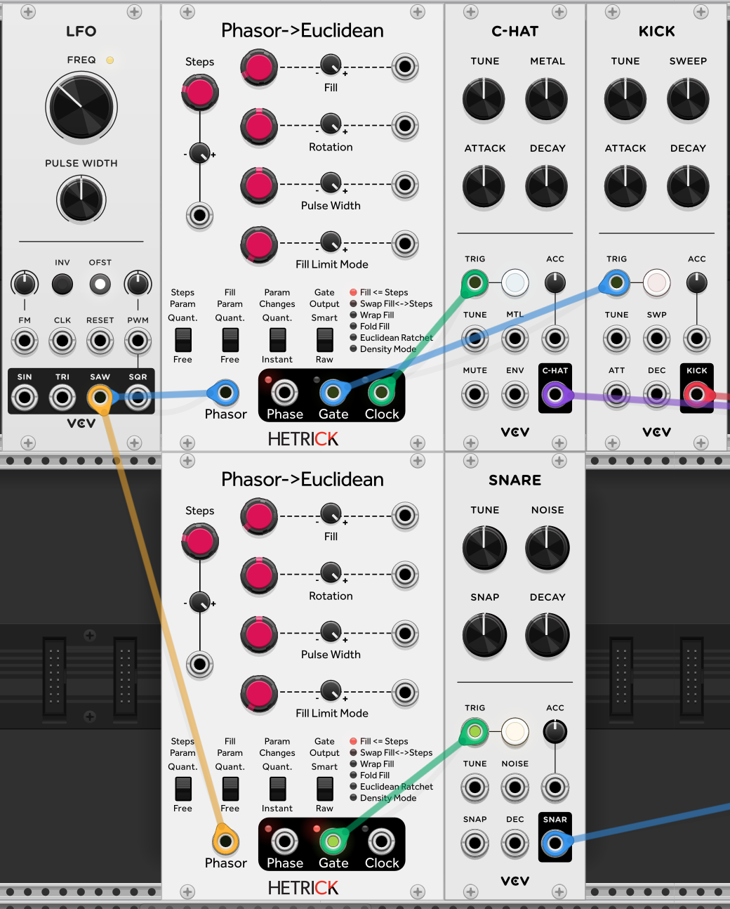
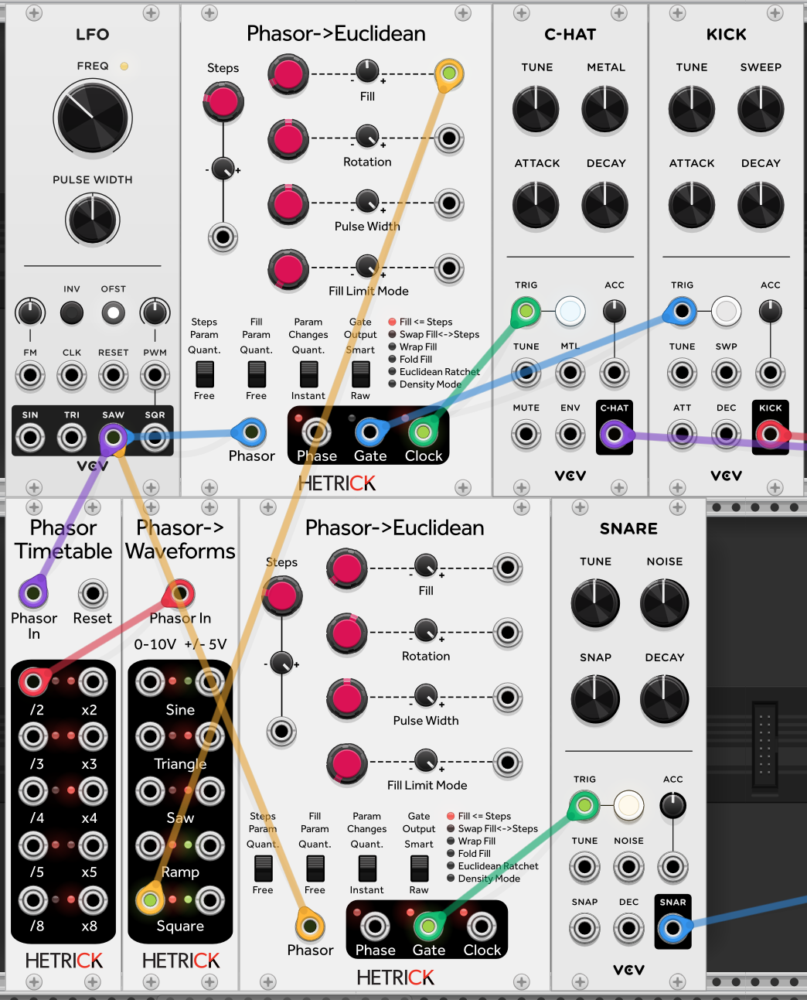
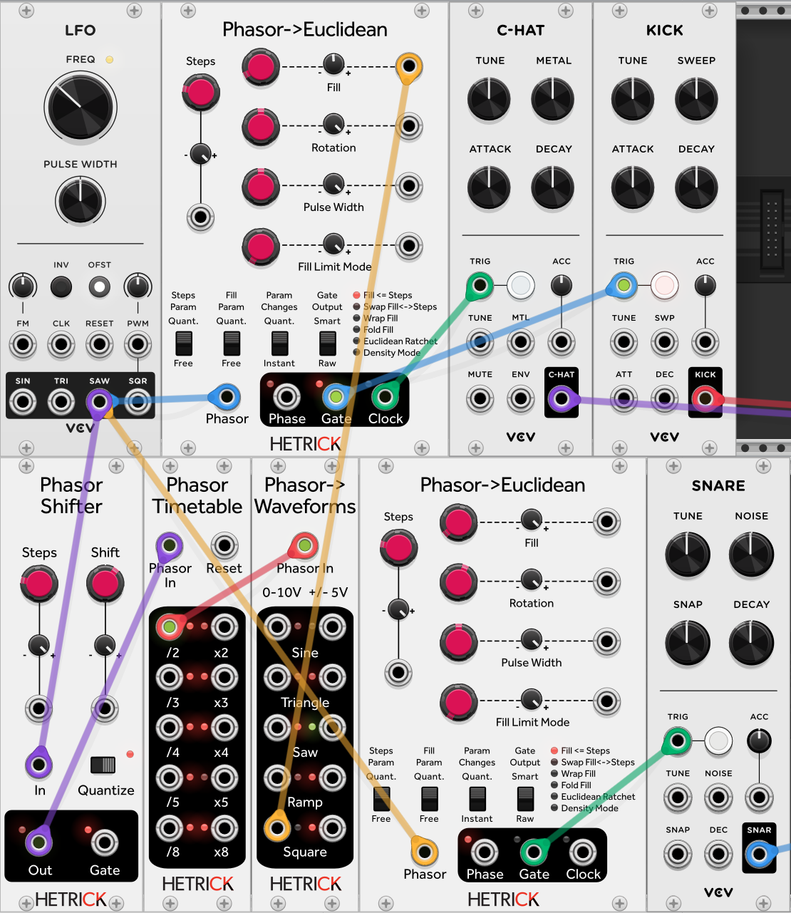
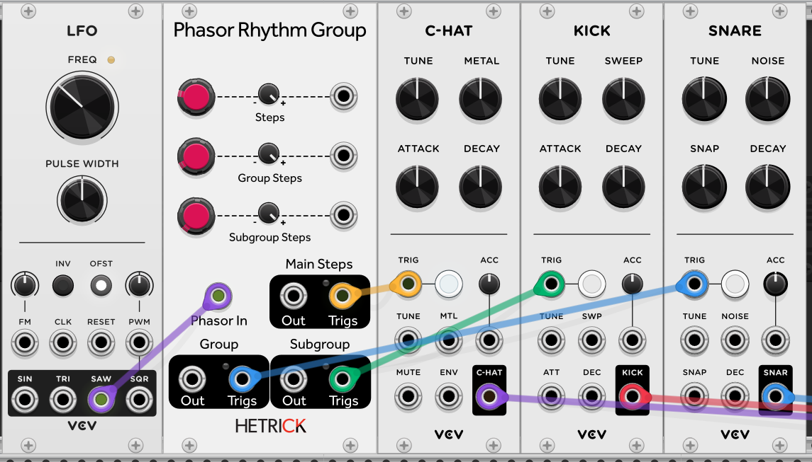
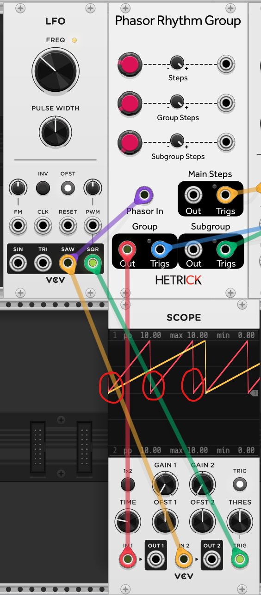
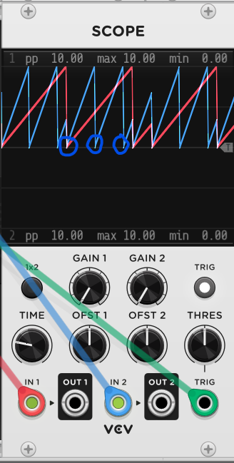
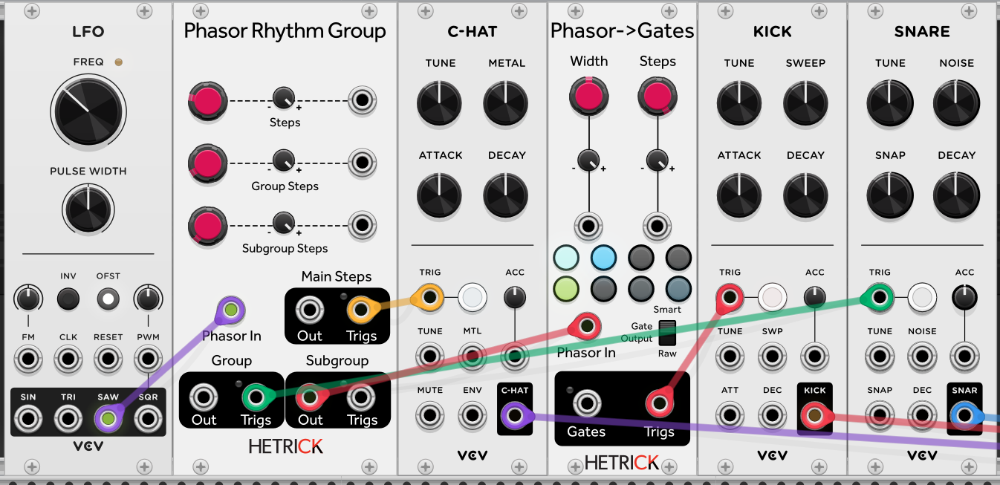
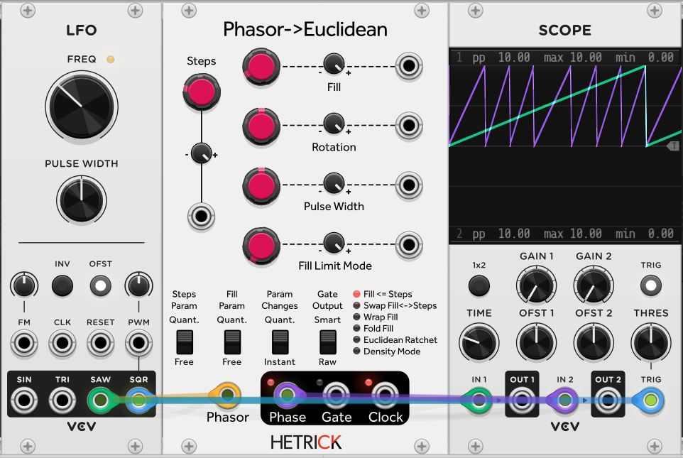
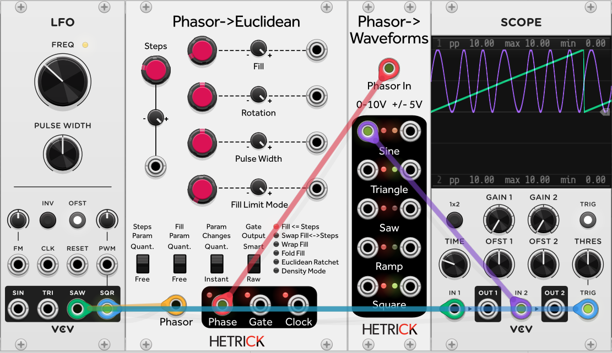

# Phase-Based Sequencing Tutorial 6 - Navigating Rhythmic Space

I can't help it: I'm a drummer. We're back to rhythm sequencing, but from a different viewpoint. We're going to look at [Phasor to Euclidean](../../Modules/PhasorEuclidean.md) and [Phasor Rhythm Group](../../Modules/PhasorRhythmGroup.md), two modules for quickly turning phasors into rhythmic sequences.

## Euclidean! Euclidean! Euclidean!
Electronic musicians love Euclidean Rhythms. They're everywhere these days. I won't dive into the theory here, but if you aren't familiar with them I recommend looking at the [Wikipedia Page](https://en.wikipedia.org/wiki/Euclidean_rhythm). The quick summary is that it's a way to generate many of the world's most used rhythms by using three numbers: Steps (N), Fill (K), and Rotation (R). 

(Side note for the fellow nerds: Rotation can be done by phase shifting the input phasor, but the Rotation control inside of this module is quantized to Steps and can additionally by time-quantized to change only on the generation of a new step).

To save space on this tutorial, I'm going to use the [VCV Drums](https://vcvrack.com/Drums) modules. If you would like a free alternative, check out [Tutorial 4](./4-PolymeterPolyrhythm.md) for recommendations. 

To get started, add a VCV LFO, a Phasor to Euclidean module, and a kick and hi-hat of your choice:

Wire the Euclidean Gate output to the Kick drum, and the Clock output to the Hi-hat. Set the Euclidean Steps to 16, and the Fill to 4. You should hear a common four-on-the-floor pattern with sixteenth-note hi-hats and quarter-note kicks. If you set Fill to 8, the kicks will happen twice as frequently, Fill 2 gives kicks half as frequently, Fill 0 gives you no kicks, and Fill 16 gives you a kick for every hat. In between all of those Fill values are a bunch of great rhythms. Try Fill 7 for a great rhythm where you get four kicks grouped together, a pause, and then three kicks grouped together.

Now that we have a nice kick + hat pattern, we need to add a snare as a backbone. Add another Phasor to Euclidean module along with a snare drum of your choice.

Start with Steps 16 and Fill 4. You should already have a pretty fun rhythm! Now adjust the Rotation knob to offset the snares in the pattern. Spend some time with this patch before moving on. You can navigate this rhythmic parameter space by changing the Fill and Rotation values on the two Euclidean modules. If you alter the number of Steps between the two modules, you will end up creating Euclidean polyrhythms (more on polyrhythms in [Tutorial 4](./4-PolymeterPolyrhythm.md)).

# A to B

This is a pretty cool rhythm, but it's a bit too stable. Plugging in an LFO to the Fill CV inputs will sound relatively good, but it might be too chaotic or unpredictable. What if we want an A rhythm and a B rhythm?

Let's break apart what we need. We want 16 steps of rhythm A, and 16 steps of rhythm B. We already have a 16 step pattern, and the 16 step pattern is driven by one cycle of our LFO. So what we need is to alternate the rhythms with each cycle of the LFO.

Phasor Timetable to the rescue! Add Phasor Timetable and Phasor to Waveforms modules to your patch. We will plug our main LFO into the Timetable, then take the /2 output and extract a square from it using Phasor->Waveforms.

This /2 square will now modulate our kick's Fill. That means every 16 steps we will change the kick's rhythm. What if we don't want the alteration to happen right on step 1? We can introduce the [Phasor Shifter](../../Modules/PhasorShifter.md) to move the square wherever we want it.

To do this, I've inserted the Phasor Shifter between the LFO and the Timetable. I've set the Shifter to 16 Steps and enabled Quantization. This keeps the phase shift to rhythmically useful values by shifting it forward or back in 1/16th steps. Now, we can move our square modulator forward or backward within our rhythm to decide where the A/B separation happens.

## A Different Drummer
Am I going to cite [Generating Sound and Organizing Time](https://cycling74.com/books/go) again? I sure am. In Chapter 2, "Modular (Arithmetic of) Time," Graham and Gregory provide a recipe for Modulo Rhythms, which I have replicated with the Phasor Rhythm Group module. This module provides three rhythmic outputs, so it is significantly easier to setup.

I've set Rhythm Group's Steps to 16, Group Steps to 7, and Subgroup Steps to 3. The Main Trigs output is connected to the hi-hat, the Group Trigs are connected to the kick, and the Subgroup represents the snare.

The general idea is that we've broken our phasor down into sixteen steps. Each of these sixteen steps fires a trigger on the Main Steps output, so we are triggering our hi-hat with what are effectively sixteenth notes (provided that we think of our phasor as a bar or measure).

From there, we group these steps using the Group Steps setting. We try to fit 7 into 16 using a divided phasor. This phasor will generate three triggers for the snare: one at the start, one seven steps later, and one seven steps after that. However, we retrigger the group 2 steps later (7 + 7 + 2 = 16). Here's a look at how this works by comparing the main LFO phasor against the Group phasor:

I have circled the snare hits in red. You can see two 7-step phasors complete, and then a smaller phasor that gets reset after 2 steps because the main phasor (in yellow) resets.

The Subgroup works the same way, but it's an additional subdivision of the Group phasor. So now we are splitting the 7-step phasor into 3-step phasors. In the scope shot below, the red line is the Group Phasor, and the blue line is the Subgroup Phasor. I have circled the Subgroup triggers in blue.

Wait a second... Rhythm Group and Euclidean are outputting sub-phasors? Does that mean...

## I Heard You Like Phasors

Yes, we can sequence subrhythms within rhythms! Let's split our phasors into more sequences. We will sneak a Phasor to Gates module between the Subgroup's phasor out and the kick.

Now, we can double every kick, or add swing, or place the kick in a different location in the phasor, or...

## Euclidean LFOs
...or we can use these phasors for modulation! Let's go back to Phasor to Euclidean and look at the phasor output for Steps 16, Fill 7:

The green line is our LFO (main phasor), and the purple line is our Euclidean phasor. Each gate output from the Euclidean module occurs when this Euclidean phasor rests. You can look at the scope and get a rough idea of the rhythm grouping: long, short, short, long, short, short, short. All we have to do is add a Phasor->Waveforms module to process this phasor:

I hope that this tutorial provided a helpful start to your phase sequencing adventure. Get out there and experiment!